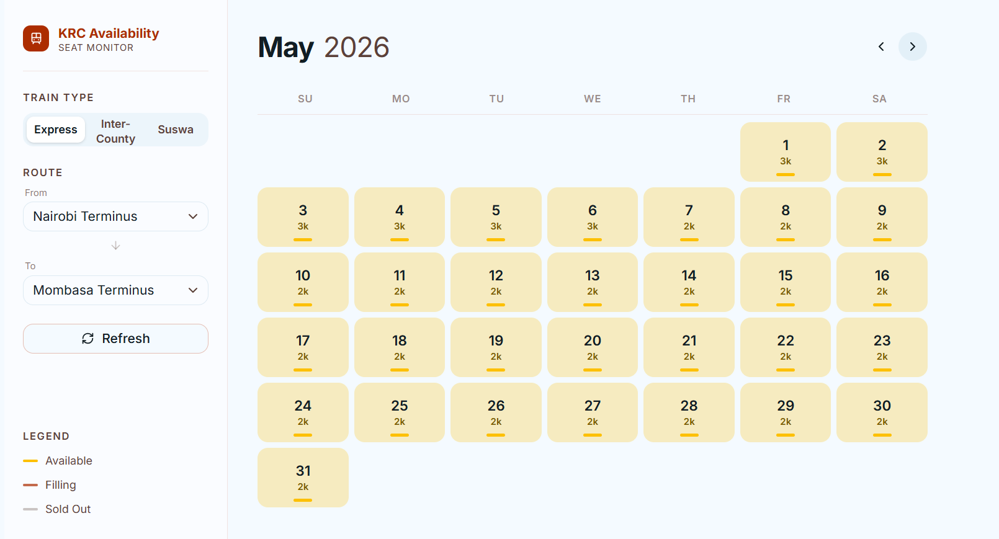
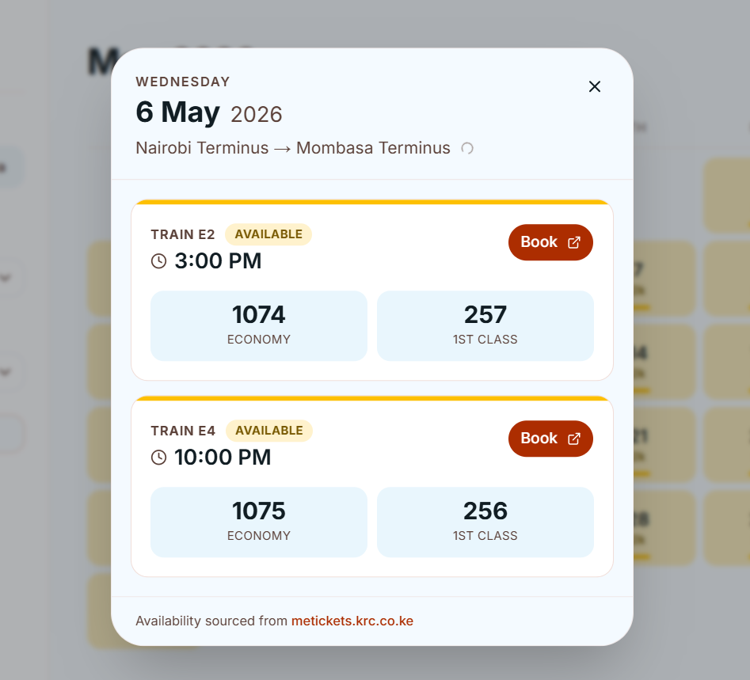

# KRC Seat Monitor

Real-time seat availability dashboard for madaraka express trains [metickets.krc.co.ke](https://metickets.krc.co.ke)



Pick a date to see per-train availability, fares, and a direct link to book.



## Setup

```bash
npm install
cp .env.local.example .env.local   # tweak if needed
npm run dev
```

## Environment

Because Vercel functions are stateless and short-lived, in-memory caches don't survive across invocations. We use [Upstash Redis](https://upstash.com/) as a serverless KV store to share scraped data between function calls, and [Upstash QStash](https://upstash.com/docs/qstash) to trigger background cache refreshes on a schedule.

| Variable                     | Default  | Purpose                                 |
| ---------------------------- | -------- | --------------------------------------- |
| `UPSTASH_REDIS_REST_URL`     | —        | Upstash Redis REST endpoint             |
| `UPSTASH_REDIS_REST_TOKEN`   | —        | Upstash Redis REST auth token           |
| `QSTASH_CURRENT_SIGNING_KEY` | —        | QStash signature verification (current) |
| `QSTASH_NEXT_SIGNING_KEY`    | —        | QStash signature verification (next)    |
| `SCRAPER_CONCURRENCY`        | `20`     | Parallel sessions per month scrape      |
| `SCRAPER_TIMEOUT`            | `30`     | Per-request timeout (seconds)           |
| `SCRAPER_RETRY`              | `2`      | Retries on transient errors             |
| `CACHE_REFRESH_INTERVAL_MS`  | `300000` | Background re-scrape interval (ms)      |
| `CACHE_SEARCH_TTL_MS`        | `30000`  | Per-day search cache TTL (ms)           |

## Stack

Next.js 16 (App Router) · TypeScript · Tailwind v4 · shadcn/ui · TanStack Query
